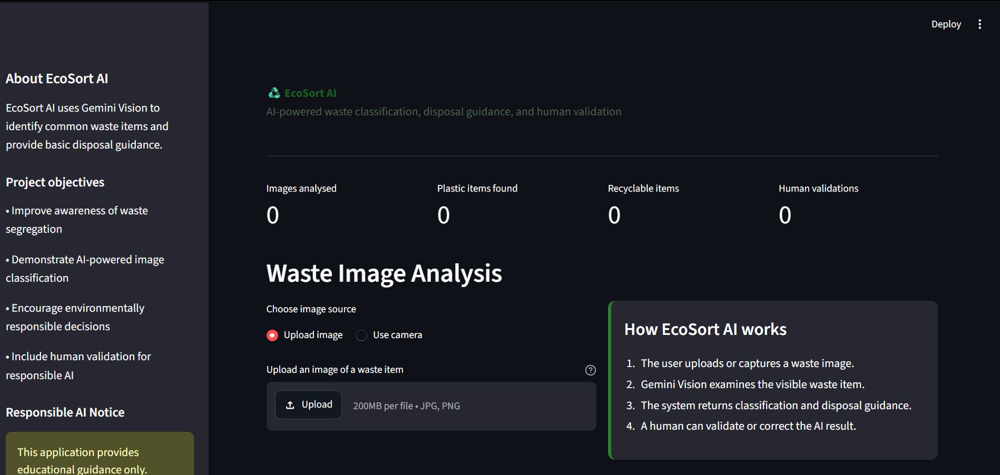
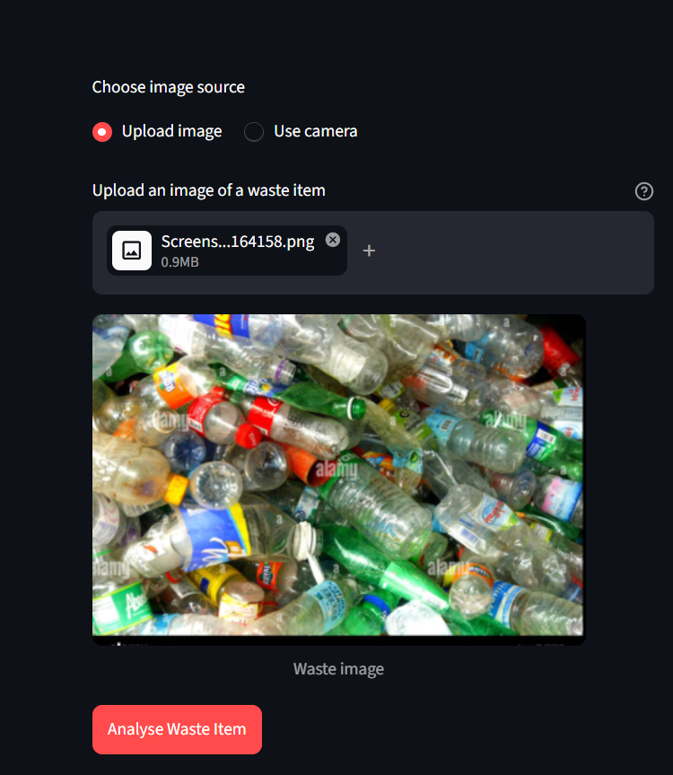
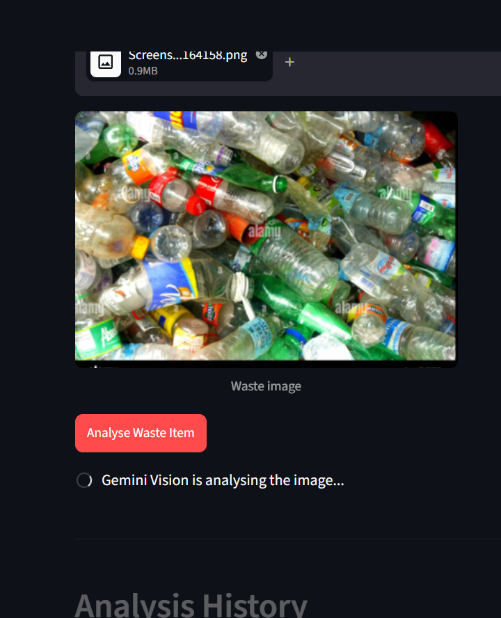
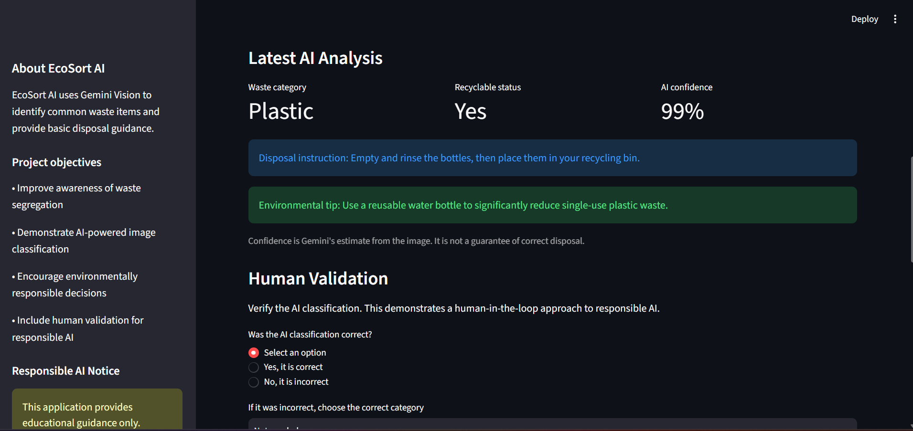
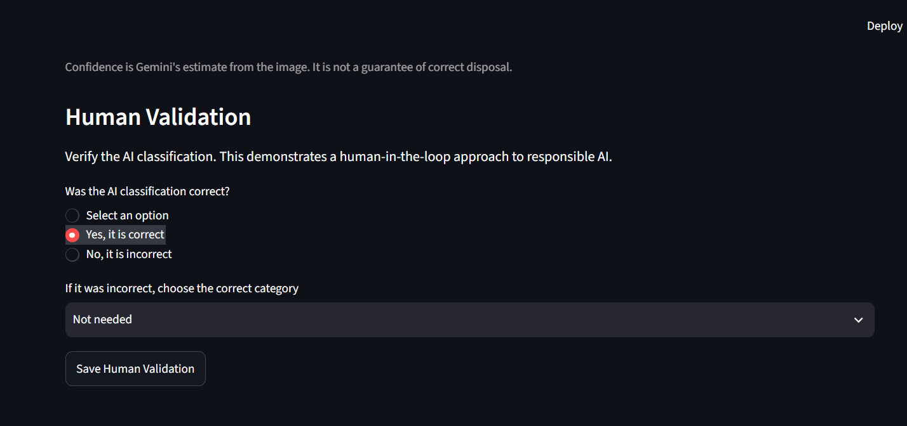
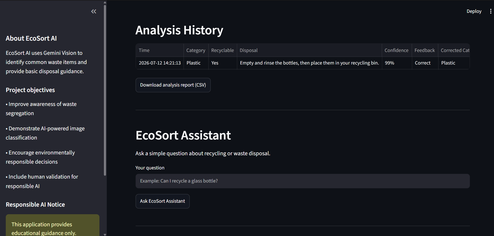
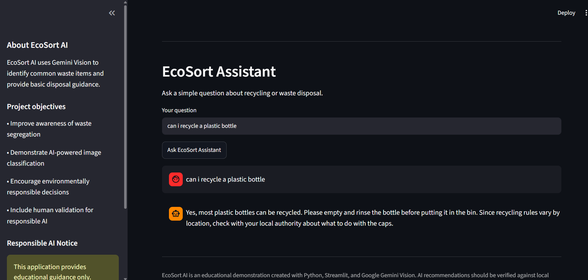

# ♻️ EcoSort AI

<div align="center">


### AI-Powered Smart Waste Classification System

Upload an image of waste and let Gemini AI identify the waste category, recyclability, disposal method, environmental impact, and recycling tips.

</div>

---

# 📌 Project Overview

EcoSort AI is an AI-powered waste classification system developed using **Python**, **Streamlit**, and **Google Gemini AI**.

The application allows users to upload an image of waste material. The AI analyzes the image and provides useful information to help users dispose of waste correctly and encourage sustainable waste management.

This project demonstrates the practical use of Generative AI in solving environmental problems.

---

# ✨ Features

- 📷 Image Upload
- 🤖 Gemini AI Image Analysis
- ♻️ Waste Classification
- ✅ Recyclable / Non-Recyclable Detection
- 🗑️ Disposal Method Suggestions
- 🌍 Environmental Impact Information
- 💡 Recycling Tips
- 📱 Simple and Interactive Streamlit Interface

---

# 🛠️ Technologies Used

- Python
- Streamlit
- Google Gemini API
- Pillow (PIL)
- python-dotenv
- Google GenAI SDK

---

## 📂 Project Structure

```
EcoSortAI/
│
├── app.py
├── requirements.txt
├── README.md
├── .env.example
├── .gitignore
└── screenshots/
    ├── home_dashboard.png
    ├── image_upload.png
    ├── analysis.png
    ├── ai_processing.png
    ├── analysis_history.png
    └── assistant.png
```

---
# 🚀 Installation

Clone the repository

```bash
git clone https://github.com/rupinder00198-dot/EcoSortAI.git
```

Go to the project directory

```bash
cd EcoSortAI
```

Install dependencies

```bash
pip install -r requirements.txt
```

Create a `.env` file

```
GEMINI_API_KEY=YOUR_API_KEY
```

Run the application

```bash
streamlit run app.py
```

---

# 📸 How It Works

1. Upload a waste image.
2. Gemini AI analyzes the image.
3. The AI predicts the waste category.
4. It checks whether the waste is recyclable.
5. Disposal instructions are displayed.
6. Environmental impact is explained.
7. Recycling tips are suggested.

---

# 🌱 Future Improvements

- Object Detection
- Barcode Scanning
- Multi-language Support
- Waste Collection Locator
- Recycling Center Finder
- Voice Assistant
- User Login
- Waste Analytics Dashboard

---

## 📸 Screenshots

### 1. Home Dashboard
Shows the main interface, project overview, and waste image upload section.



---

### 2. Image Upload
Uploading a waste image for AI analysis.



---

### 3. AI Processing
Gemini Vision analyzing the uploaded image.



---

### 4. AI Analysis Result
Displays the predicted waste category, recyclability, disposal instructions, environmental tip, and confidence score.



---

### 5. Human Validation
Users can verify or correct the AI prediction to support responsible AI.



---

### 6. Analysis History
Stores previous analyses and allows downloading a CSV report.



---

### 7. EcoSort Assistant
AI-powered assistant that answers recycling and waste disposal questions.



---

## 👥 Team Members

This project was developed as a collaborative team project by students of the **B.Sc. Computational Statistics and Data Analytics** program.

| Name | Role |
|------|------|
| **Rupinder Kaur** | Project Development, AI Integration, Streamlit Application Development |
| **Prabhjeet Kaur** | Research, Documentation, Testing and Validation |
| **Ramandeep Kaur** | UI Design, Feature Testing, Project Support |

### Team Contribution

The team worked collaboratively throughout the project, contributing to the design, development, testing, documentation, and overall implementation of the **EcoSort AI** application. Each member participated in different stages of the project to ensure successful completion.

---

# 📄 License

This project is developed for educational and certification purposes.
